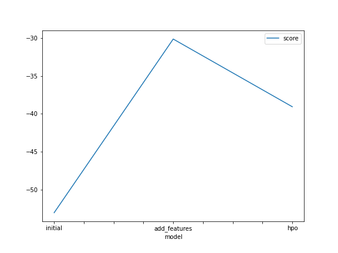
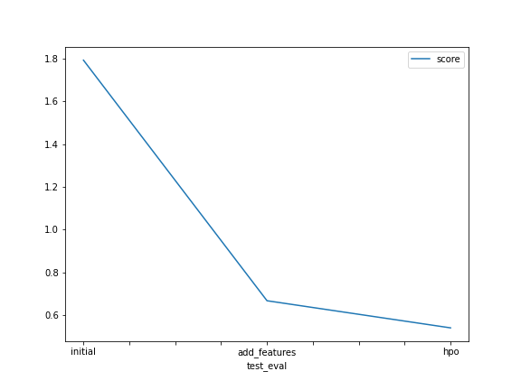

# Report: Predict Bike Sharing Demand with AutoGluon Solution
#### AQDAS AHMAD KHAN

## Initial Training
### What did you realize when you tried to submit your predictions? What changes were needed to the output of the predictor to submit your results?
There should not be negative values. The negative values were updated to zero.

### What was the top ranked model that performed?
WeightedEnsemble_L3

## Exploratory data analysis and feature creation
### What did the exploratory analysis find and how did you add additional features?
The combined datetime should be separated into year, month, day and hour. The additional features were added by parsing the datetime and extracting the required values.

### How much better did your model preform after adding additional features and why do you think that is?
62.82% better than initial model. It is because by adding additional feature the model can determine which feature (newly added) is more important than the other, e.g. is hour of day is more important or month is more important, etc.

## Hyper parameter tuning
### How much better did your model preform after trying different hyper parameters?
69.90% better than initial model.

### If you were given more time with this dataset, where do you think you would spend more time?
In tuning the hyperparameters

### Create a table with the models you ran, the hyperparameters modified, and the kaggle score.
|model|RF|CAT|XGB|GBM|score|
|--|--|--|--|--|--|
|initial|Default|Default|Default|Default|1.79271|
|add_features|Default|Default|Default|Default|0.66657|
|hpo|[{criterion': 'gini'}, {'criterion': 'entropy'}]|{'learning_rate': 0.001, 'depth': 8, 'l2_leaf_reg': 10}|{'learning_rate': 0.001, 'objective': 'regpseudohubererror', 'eval_metric': 'rmse'}|{'learning_rate': 0.001, 'max_depth': 10000}|0.53955|

### Create a line plot showing the top model score for the three (or more) training runs during the project.

### Create a line plot showing the top kaggle score for the three (or more) prediction submissions during the project.

## Summary
It is important to separate the combined datetime into individual components and add as new features. This enhanced the model's performance by 62.82%. Further improvements were achieved through hyperparameter tuning, resulting in a 69.90% overall improvement compared to the initial model. Initially, WeightedEnsemble_L3 performed better and also after adding new features, but after hyperparameter tuning, LightGBM_BAG_L2/T1 performed better.